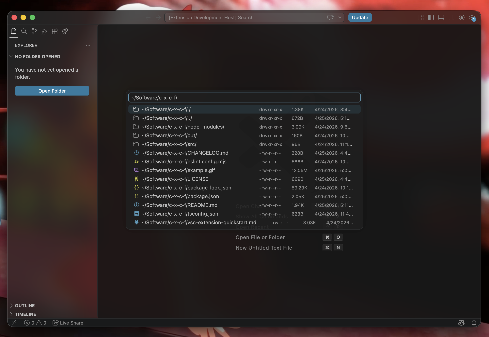

# C-x C-f

> Wait, it's 6202 now but VSCode still cannot find files outside the workspace?...

The missing "Find File" utility for VSCode.

## Features

Press `Ctrl+X Ctrl+F` to open a file picker and find file you want

> Tab completions for file name does not work, select & press `Enter` instead!

> If you've installed other extensions that has already bind `Ctrl+X Ctrl+F` (like Emacs-like extensions), remove existed bindings by `Ctrl+Shift+P Preferences: Open Keyboard Shortcuts` (typically `Ctrl+K Ctrl+S` or `Cmd+K Cmd+S` on darwin)

> The command is named "C-x C-f: Find File" (`"c-x-c-f.findFile"`)

## Extension Settings

- `c-x-c-f.showHiddenFiles`: Show hidden files in the picker even if you didn't insert a dot. (default: `false`)
- `c-x-c-f.openFolderInNewWindow`: Open the selected folder in a new window instead of adding it to the workspace. (default: `true`)

Specially, for element alignment:

- `c-x-c-f.UIFont`: Path to the font of VSCode UI. Used to calculate alignment in the picker. If not set, the extension will try to guess it based on the OS or using fc-match. (default: `""`)
- `c-x-c-f.UIFontPostscriptName`: Postscript name of the UI Font, if UI Font is a TrueType Collection (.ttc) (default: `""`)

## Known Issues

- Some element may not correcly aligned

---

## Acknowledgements

Thanks our sister Simone, and our lover misaka18931, who love and support us.

Supporting Neurodiversity & Transgender & Plurality!

🏳️‍🌈🏳️‍⚧️
